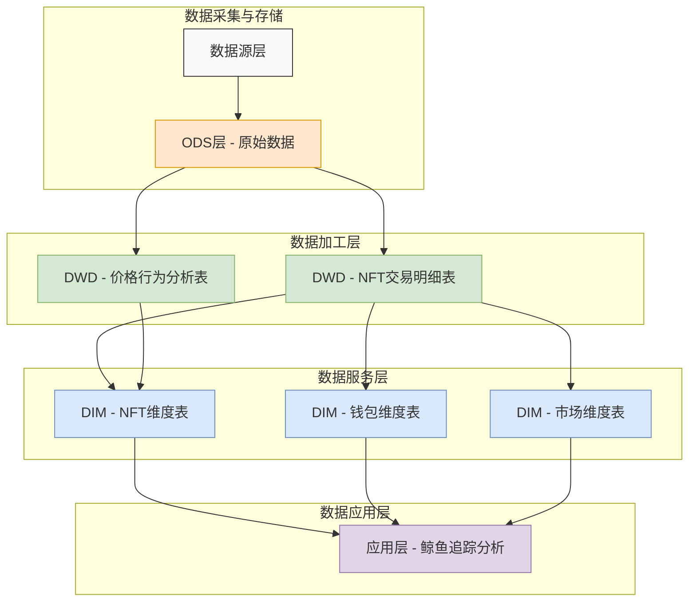

# NFT鲸鱼追踪系统 - 数据流图

上图展示了NFT鲸鱼追踪系统的整体数据流程，从数据源到应用层的完整数据路径。

## 数据流程说明

### 数据采集与存储
- **数据源层**：区块链交易数据、NFT元数据、市场API等外部数据
- **ODS层**：原始数据存储，保留原始格式的NFT交易记录

### 数据加工层 (DWD)
- **NFT交易明细表**：清洗、标准化交易数据，识别鲸鱼交易
- **价格行为分析表**：分析NFT价格变动、波动率和趋势

### 数据服务层 (DIM)
- **NFT维度表**：NFT全面画像，包括创建者、持有者和交易历史
- **钱包维度表**：用户画像，区分普通用户和鲸鱼用户
- **市场维度表**：交易平台画像，包括市场规模和特性

### 数据应用层
- **鲸鱼追踪分析**：鲸鱼行为分析、市场趋势、投资机会识别

## 技术实现
- 实时处理：Flink SQL流处理
- 存储层：Paimon表格式
- 元数据管理：Hive Metastore
- 计算框架：Flink 