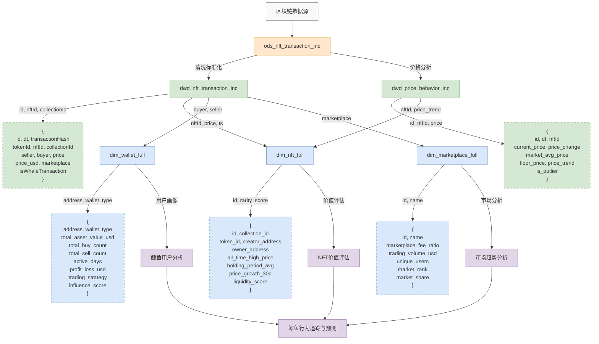

# NFT鲸鱼追踪系统 - 详细数据流图

## 表间关系说明

### ODS层到DWD层
- **ods_nft_transaction_inc → dwd_nft_transaction_inc**:
  - 标准化交易数据，添加价格换算（ETH/USD）
  - 标记鲸鱼交易，计算异常评分
  - 提取时间维度信息

- **ods_nft_transaction_inc → dwd_price_behavior_inc**:
  - 分析价格变动趋势和幅度
  - 计算相对地板价差异
  - 识别异常价格波动

### DWD层到DIM层
- **dwd_nft_transaction_inc → dim_nft_full**:
  - 汇总NFT交易历史
  - 计算交易频率、价格高低点
  - 识别当前持有者和创建者

- **dwd_nft_transaction_inc → dim_wallet_full**:
  - 分析用户交易行为
  - 统计买入/卖出比例
  - 评估用户影响力和活跃度

- **dwd_nft_transaction_inc → dim_marketplace_full**:
  - 计算平台交易量和用户数
  - 分析平台市场份额和增长率

## 核心表字段说明

### DWD层
- **dwd_nft_transaction_inc**: NFT交易明细，包含交易ID、NFT标识、买卖双方、价格、交易市场等
- **dwd_price_behavior_inc**: 价格行为分析，包含价格变动、偏离度、趋势判断等

### DIM层
- **dim_nft_full**: NFT画像，包含创建者、持有者、价格历史、流动性评分等
- **dim_wallet_full**: 钱包画像，包含交易统计、持仓资产、盈亏情况、活跃度等
- **dim_marketplace_full**: 市场画像，包含交易量、用户数、市场份额、费率等

## 技术实现
- **实时处理引擎**: Apache Flink
- **SQL语言**: Flink SQL
- **存储格式**: Paimon（支持增量更新）
- **元数据管理**: Hive Metastore
- **计算策略**: 增量计算 + 全量更新 